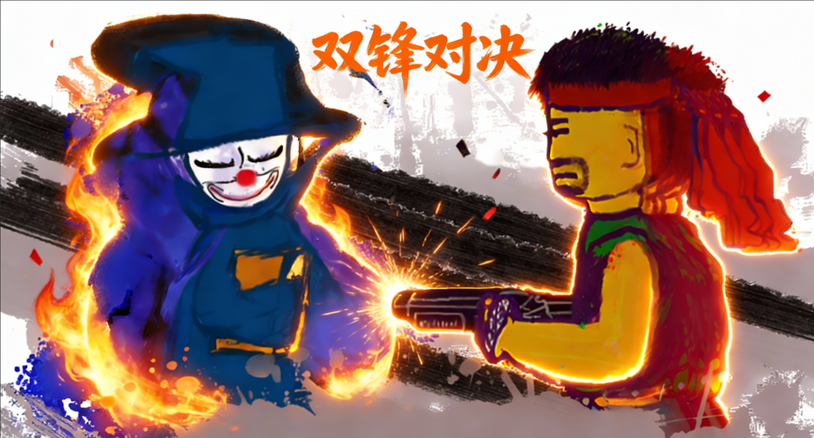

# 双锋对决 (Dual Edge Showdown)



双锋对决是一款使用HTML5+JavaScript编写的2D横版双人格斗类网页游戏。游戏提供法师与机械师两个特色角色，每个角色拥有自己专属的技能系统和终极技能，通过多回合对战决定胜负。

## 目录

- [游戏特性](#游戏特性)
- [快速开始](#快速开始)
- [系统要求](#系统要求)
- [安装与运行](#安装与运行)
- [角色介绍](#角色介绍)
- [操作方式](#操作方式)
- [游戏机制](#游戏机制)
- [数据库集成](#数据库集成)
- [项目结构](#项目结构)
- [技术信息](#技术信息)
- [贡献指南](#贡献指南)
- [更新日志](#更新日志)
- [常见问题](#常见问题)

## 游戏特性

- **双人对战模式**：支持本地双人同屏对战
- **独特角色系统**：法师与机械师拥有完全不同的技能体系
- **能量积累机制**：通过攻击积累能量，释放终极技能
- **多样化技能**：每个角色拥有4个主动技能和1个终极技能
- **回合制对战**：三局两胜制，率先赢得2个回合的玩家获胜
- **音效系统**：完整的背景音乐和技能音效，支持音效开关
- **地图互动**：包含地图元素和医疗包等可互动场景
- **暗黑风格UI**：现代化的游戏界面设计
- **用户系统**：支持账户注册、登录和游戏数据保存
- **排行榜系统**：记录和展示玩家的游戏成绩

## 快速开始

1. 克隆或下载项目文件到本地
2. 使用现代浏览器打开 `index.html` 文件
3. 点击"START"按钮进入游戏
4. 选择登录账户或使用游客模式开始游戏

## 系统要求

- **浏览器**：Chrome 70+、Firefox 65+、Safari 12+、Edge 79+
- **分辨率**：推荐1500x700或更高分辨率
- **网络**：可选，仅在使用数据库功能时需要

## 安装与运行

### 本地运行

1. 下载或克隆项目文件到本地
```bash
git clone [项目仓库地址]
cd Dual-Edge-Showdown
```

2. 直接用浏览器打开 `index.html` 文件
3. 或者使用本地服务器（推荐）：
```bash
# 使用Python
python -m http.server 8000

# 使用Node.js
npx serve .

# 访问 http://localhost:8000
```

### 数据库配置（可选）

如果需要使用完整的用户系统和数据保存功能，请配置Supabase数据库：

1. 访问 [Supabase官网](https://supabase.com) 并创建项目
2. 复制项目URL和API密钥到 `scripts/supabase.js` 中
3. 在Supabase SQL编辑器中运行 `database/database_init.sql` 脚本

详细配置指南请参考 [docs/SUPABASE_SETUP.md](docs/SUPABASE_SETUP.md)

## 角色介绍

### 🧙 法师 (Mage)
- **生命值**：3800HP
- **特点**：远程魔法攻击，擅长控制和大范围伤害

#### 技能系统
| 技能 | 按键 | 效果 | 冷却时间 |
|------|------|------|----------|
| 法力凝聚 | H | 永久增加10%基础属性，可叠加 | 13秒 |
| 魔焰射线 | J | 向正前方发射一条300px的射线，180点瞬间伤害 | 0.5秒攻击速度 |
| 魔障 | K | 为自身释放一个持续2.8秒的护盾，最多可吸收400点伤害 | 8秒 |
| 炎爆术 | B | 向正前方释放一个火球，咏唱越久伤害越高，最高可秒杀，最低50点 | 12秒 |
| 替身(大招) | Q | 创造替身并提供2000HP护甲，替身会向敌人投掷微型火球 | 能量满 |

#### 特殊机制
- 炎爆术咏唱时移动速度减半
- 替身每存在1秒，为本体恢复60HP
- 替身会持续向敌人投掷微型火球，每个200HP伤害，1.5秒CD

### 🤖 枪械师 (Mechanician)
- **生命值**：4000HP
- **特点**：灵活机动，擅长快速打击和范围爆发

#### 技能系统
| 技能 | 按键 | 效果 | 冷却时间 |
|------|------|------|----------|
| 血祭 | U | 增加50%全属性和100%攻击速度，持续3秒 | 8秒 |
| 射击 | I | 向正前方200px射击，造成1-200点瞬间伤害 | 0.3秒攻击速度 |
| 突进 | O | 突进至正前方4个单位，无视碰撞 | 1.2秒 |
| 微型核弹 | P | 向目标发射一颗微型核弹，距离越远伤害越高 | 根据蓄力时间 |
| 恐怖机器人(大招) | L | 释放3个恐怖机器人，快速移动并追踪敌人 | 能量满 |

#### 特殊机制
- 血祭消耗120点生命值
- 微型核弹可通过按住蓄力增加伤害和速度
- 恐怖机器人碰到目标后爆炸，每个机器人造成800点伤害
- 恐怖机器人可被击毁

## 操作方式

### 法师(左侧玩家)
- **移动**：A(左)、D(右)
- **跳跃**：W(可二段跳)
- **技能**：H(法力凝聚)、J(魔焰射线)、K(魔障)、V(炎爆术蓄力/释放)
- **大招**：Q(替身，需能量满)

### 枪械师(右侧玩家)
- **移动**：←(左)、→(右)
- **跳跃**：↑(可二段跳)
- **技能**：U(血祭)、I(射击)、O(突进)、P(微型核弹蓄力/释放)
- **大招**：L(恐怖机器人，需能量满)

## 游戏机制

### 能量系统
- 通过攻击敌人积累能量
- 能量达到100%时可使用终极技能
- 使用终极技能会清空所有能量

### 回合系统
- 游戏采用三局两胜制
- 每个回合角色位置会互换
- 率先赢得2个回合的玩家获胜

### 地图元素
- **医疗包(小)**：位于地图左侧，恢复400点生命值
- **医疗包(大)**：位于地图右侧，恢复800点生命值
- **地形元素**：影响角色移动和跳跃

## 数据库集成

本项目集成了Supabase数据库，提供以下功能：

- **用户系统**：注册、登录、游客模式
- **数据保存**：游戏进度、分数记录、统计信息
- **排行榜**：全球分数排行榜
- **成就系统**：解锁新关卡和角色成就

详细的数据库配置和使用说明请参考 [docs/SUPABASE_SETUP.md](docs/SUPABASE_SETUP.md)

## 项目结构

```
Dual Edge showdown/
├── assets/                 # 游戏资源文件
│   ├── images/            # 图片资源
│   └── sounds/            # 音频资源
├── database/              # 数据库相关
│   └── database_init.sql  # 数据库初始化脚本
├── docs/                  # 文档目录
├── pages/                 # 游戏页面
│   ├── game.html         # 游戏主界面
│   ├── help.html         # 帮助界面
│   ├── login.html        # 登录界面
│   └── leaderboard.html  # 排行榜界面
├── scripts/               # JavaScript脚本
│   ├── control.js        # 游戏控制逻辑
│   ├── supabase.js       # 数据库连接
│   └── ...
├── styles/               # CSS样式文件
├── supabase/             # Supabase配置
└── index.html           # 主入口文件
```

## 技术信息

- **技术栈**：HTML5、CSS3、JavaScript (jQuery)、Supabase
- **兼容性**：支持现代浏览器(Chrome、Firefox、Safari、Edge)
- **运行方式**：本地运行或部署到Web服务器
- **屏幕分辨率**：最佳体验在1500x700或更高分辨率
- **数据存储**：本地存储 + Supabase云数据库

## 贡献指南

欢迎提交问题报告和功能请求！如果您想为项目做出贡献，请遵循以下步骤：

1. Fork 项目
2. 创建功能分支 (`git checkout -b feature/AmazingFeature`)
3. 提交更改 (`git commit -m 'Add some AmazingFeature'`)
4. 推送到分支 (`git push origin feature/AmazingFeature`)
5. 打开 Pull Request

## 更新日志

### v2.0 (当前版本)
- 添加用户系统和数据库集成
- 实现游戏数据保存和排行榜功能
- 优化UI界面和游戏体验
- 添加音效和背景音乐

### v1.0
- 初始版本发布
- 实现基本双人对战功能
- 完成角色技能系统
- 添加音效和背景音乐
- 实现主菜单和帮助系统

## 常见问题

### Q: 游戏无法正常加载？
A: 请确保使用现代浏览器，并检查是否禁用了JavaScript。如果仍然有问题，尝试清除浏览器缓存。

### Q: 如何保存游戏进度？
A: 注册账户并登录后，游戏进度会自动保存到云端。游客模式下数据仅保存在本地。

### Q: 游戏卡顿或性能问题？
A: 尝试关闭浏览器其他标签页，降低游戏分辨率，或使用性能更好的浏览器。

### Q: 数据无法同步？
A: 检查网络连接，确认Supabase配置是否正确，查看浏览器控制台错误信息。

---

**开发者**：[您的团队名称]
**许可协议**：[您的许可协议]
**联系方式**：[您的联系方式]

享受双锋对决的激烈战斗！🎮⚔️